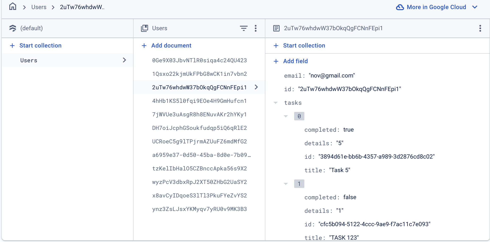

# ToDo App (Kotlin Multiplatform)

This is a cross-platform ToDo application developed using Kotlin Multiplatform, allowing it to run on both iOS and Android devices. The app enables users to create, update, and manage their tasks.

## Features
- **Cross-platform support**: Built using Kotlin Multiplatform, sharing business logic between iOS (SwiftUI) and Android (Jetpack Compose) with platform-specific UI components.
- **Task Management**: Users can create, edit, and delete tasks.
- **Authentication**: Integrated Firebase Authentication for secure login and user-specific task management.
- **State Management**: Follows the MVVM architecture for separation of concerns and reactive state management on both platforms.
- **Persistent Data**: Uses Firestore to persist tasks across sessions.

## Project Structure
This is a Kotlin Multiplatform project targeting Android and iOS:

- `/composeApp`: Contains the code shared across your Compose Multiplatform applications.
  - `commonMain`: For code that’s common for all targets.
  - Other folders like `iosMain` are for Kotlin code compiled for specific platforms.
    For example, if you need to call Apple’s CoreCrypto in iOS, you would put that code in `iosMain`.

- `/iosApp`: Contains the iOS application. Even if the UI is shared with Compose Multiplatform, this entry point is required for the iOS app. SwiftUI code can also be added here.

- `/shared`: Contains code shared between all targets in the project.
  - `commonMain` is the most important subfolder, where shared code between iOS and Android lives.
  - Platform-specific folders (e.g., `androidMain`, `iosMain`) can also be used if needed.

Learn more about [Kotlin Multiplatform](https://www.jetbrains.com/help/kotlin-multiplatform-dev/get-started.html).

## Tech Stack
- **Kotlin Multiplatform**: Shared business logic between iOS and Android.
- **SwiftUI** (iOS).
- **Jetpack Compose** (Android).
- **Firebase**: For authentication and Firestore as the backend for task storage.

## Installation
Clone the repository and run the app on either Android Studio or Xcode depending on the platform you are targeting.

## Screenshots & Demonstrations

### iOS and Android Demo

### Screenshot Firestore

